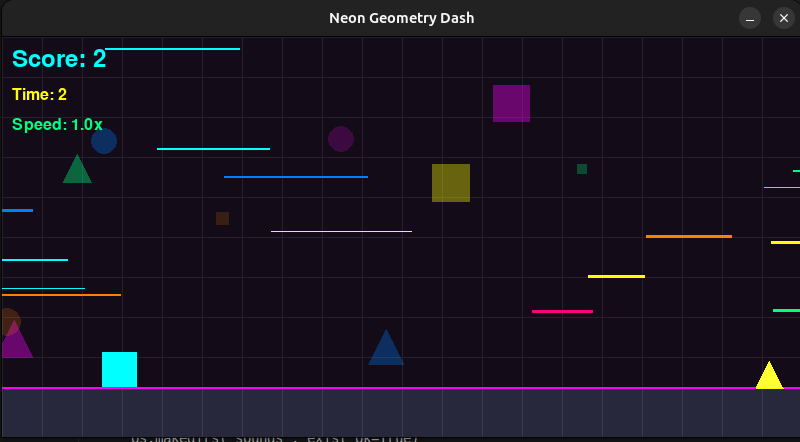
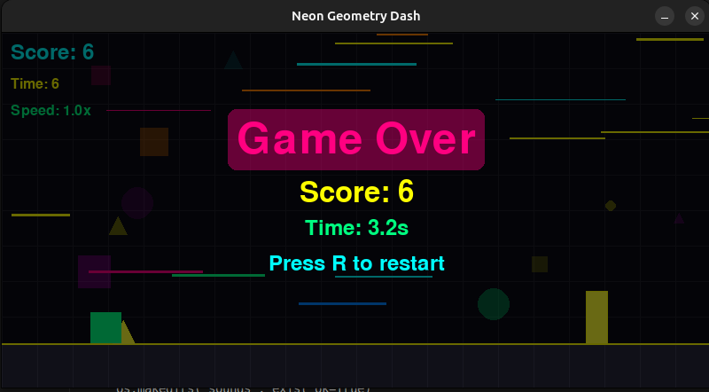

# Neon Geometry Dash

A Pygame implementation of a Geometry Dash-like game with neon visual effects, dynamic backgrounds, and color-changing elements.

## Game Preview


*Screenshot of gameplay showing the player, obstacles, and neon background effects*


*Screenshot of the game over screen with neon effects*

## Features

- **Geometric Gameplay**: Control a square that automatically moves forward and jumps over obstacles
- **Dynamic Neon Visuals**: 
  - Scrolling background with lines and geometric shapes
  - Background color changes every 10 seconds
  - Player color changes on music beats
  - Vibrant neon color palette
- **Visual Effects**:
  - Player trail effects
  - Pulsing glow on player and obstacles
  - Grid patterns and parallax scrolling
- **Obstacle Types**:
  - Rectangular obstacles with varying sizes
  - Triangular obstacles to jump over
- **Score System**: 
  - Points increase as you successfully avoid obstacles
  - Time-based scoring (2 points per second)
  - Final score displayed on game over screen
- **Progressive Difficulty**:
  - Game speed increases every 15 seconds
  - "Speed Up" notifications
  - Maximum speed cap for playability
- **Audio Features**:
  - 8-bit style background music
  - Sound effects for jumping, crashing, and speed increases
  - Background color changes synchronized with music beats
  - Player color changes on music beats 


## Controls

- **Space**: Jump
- **R**: Restart after game over
- **Close Window**: Quit game

## Requirements

- Python 3.x
- Pygame library

## Installation

1. Make sure you have Python installed on your system
2. Install Pygame:
```
pip install pygame
```
3. Run the game:
```
python geometry_dash.py
```

## How to Play

1. Your character (a square) automatically moves forward
2. Press the spacebar to jump over obstacles
3. Avoid hitting rectangular and triangular obstacles
4. Try to achieve the highest score possible
5. The game gets faster every 15 seconds, increasing the challenge

## Implementation Details

The game is built using Pygame and features:

- Object-oriented design with classes for Player, Obstacle, and BackgroundEffect
- Collision detection with forgiving hitboxes
- Dynamic visual effects using alpha blending and surface manipulation
- Beat-based and timed color changes
- Particle and trail effects
- Progressive difficulty system
- Procedurally generated 8-bit sound effects and music
- Audio-visual synchronization


## Adding Your Own Features

You can easily extend the game by:

- Adding new obstacle types
- Creating power-ups
- Implementing level designs
- Adding sound effects and music
- Creating different game modes

## License

This project is open source and available for personal and educational use.

## Credits

Created as part of the Amazon Q CLI Challenge.
